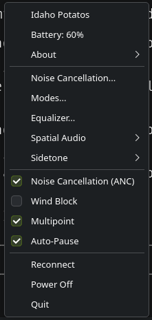
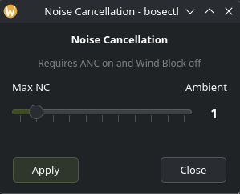
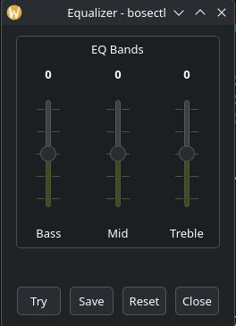
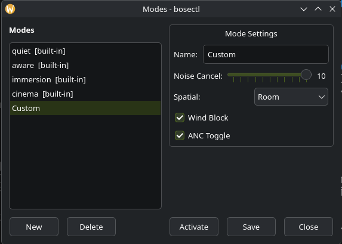

# bosectl-qt

A Qt6 system tray application for controlling Bose headphones over Bluetooth on Linux. Built on the reverse-engineered [bosectl](https://github.com/aaronsb/bosectl) BMAP library — no cloud, no accounts, no official app required.

To the best of my knowledge this is the first Qt/native tray app on Linux that supports the Bose QuietComfort Ultra Headphones.

## Screenshots

### Tray menu



### Noise cancellation



### Equalizer



### Mode manager



## Features

- **Auto-discovery** of paired BMAP devices via `bluetoothctl`
- **Noise cancellation** slider (0–10) with a clear "Max NC → Ambient" labeling
- **ANC** and **Wind Block** toggles (both affect whether the NC slider is audible)
- **Mode manager** — view, activate, edit, create, and delete custom modes. Built-in presets (Quiet, Aware, Immersion, Cinema) are protected
- **Equalizer** — Bass / Mid / Treble sliders with Try / Save / Reset
- **Spatial audio** — Off, Room, Head Tracking
- **Sidetone** — Off, Low, Medium, High
- **Multipoint** and **Auto-Pause** toggles
- **Battery, firmware, and MAC** display under an *About* submenu
- **Working indicator** across all windows for feedback during BT operations
- **Settings persistence** in `~/.config/bosectl-qt/` — remembers your last device
- **Auto-start** via XDG desktop entry (optional)
- **Cross-desktop** — uses plain `QSystemTrayIcon` so it works on KDE, GNOME, Xfce, Sway, and anything else with an SNI/XEmbed tray

## Supported devices

Currently verified:

- **Bose QuietComfort Ultra Headphones**
- **Bose QuietComfort 35 / 35 II** (via the bosectl library, untested in Qt UI)

Other Bose devices may work — see the [bosectl device support list](https://github.com/aaronsb/bosectl#supported-devices).

## Installation

### Arch Linux (AUR)

```bash
# Stable release
yay -S bosectl-qt

# Git HEAD
yay -S bosectl-qt-git
```

(Replace `yay` with your preferred AUR helper, or use `makepkg` directly.)

### Other distros

Flatpak and AppImage builds are planned. For now, [build from source](#building).

## Building

### Dependencies

- CMake ≥ 3.16
- Qt6 (Widgets)
- libbluetooth (BlueZ)
- A C++17 compiler

On Arch:

```bash
sudo pacman -S qt6-base bluez-libs cmake
```

On Debian/Ubuntu:

```bash
sudo apt install qt6-base-dev libbluetooth-dev cmake build-essential
```

On Fedora:

```bash
sudo dnf install qt6-qtbase-devel bluez-libs-devel cmake gcc-c++
```

### Build

```bash
git clone --recursive https://github.com/aaronsb/bosectl-qt
cd bosectl-qt
cmake -B build
cmake --build build
./build/bosectl-qt
```

If you forgot `--recursive`, run:

```bash
git submodule update --init --recursive
```

### Install

```bash
sudo cmake --install build
```

This installs the binary to `/usr/local/bin`, the desktop file to `/usr/local/share/applications`, the icon to the hicolor theme, and an XDG autostart entry.

## Usage

1. Pair and connect your Bose headphones via `bluetoothctl` or your desktop's Bluetooth settings
2. Launch `bosectl-qt`
3. The tray icon auto-discovers the first connected BMAP device and shows status in the tooltip
4. Right-click the tray icon for the full control menu

The sliders and the Mode manager open separate windows instead of being embedded in the tray menu — this is a deliberate design choice because Qt's `QWidgetAction` doesn't render reliably inside menus on Wayland.

### Noise cancellation quirks

Bose firmware has a couple of interactions that aren't obvious from the UI alone:

- **ANC must be on** for the NC slider to have any audible effect — if you turn ANC off, the slider stops doing anything
- **Wind Block overrides the NC slider** — if Wind Block is on, the NC DSP is bypassed regardless of slider position

The NC window displays a reminder about these, and ANC / Wind Block are exposed as separate tray menu toggles so you can manage them independently.

## Architecture

```
┌─────────────────────────────────────┐
│ GUI thread (Qt widgets)             │
│ ├── TrayIcon (QSystemTrayIcon)      │
│ ├── NcWindow / EqWindow             │
│ └── ModeWindow                       │
└────────────┬────────────────────────┘
             │ signals/slots (queued)
┌────────────┴────────────────────────┐
│ Worker thread                       │
│ └── BmapWorker → bmap::BmapConnection│
└────────────┬────────────────────────┘
             │ RFCOMM (Bluetooth socket)
┌────────────┴────────────────────────┐
│ Headphones (BMAP protocol)          │
└─────────────────────────────────────┘
```

All blocking Bluetooth I/O runs on a dedicated worker thread. The GUI queues operations via `QMetaObject::invokeMethod` and receives state updates via queued signals. A RAII `BusyGuard` around each worker slot emits `busy(true/false)` so every window can show a "Working…" indicator automatically.

Settings are stored in `~/.config/bosectl-qt/bosectl-qt.conf` via `QSettings`.

## Roadmap

- [ ] Pre-built binaries: Flatpak, AppImage, Arch AUR, Debian package
- [ ] CI builds with GitHub Actions
- [ ] Button remapping UI (bmap library already supports it)
- [ ] Voice prompts language selector
- [ ] Extended device support (QC Ultra Earbuds, QC45, etc.) once bosectl upstream adds configs
- [ ] Translations

## Credits

- [bosectl](https://github.com/aaronsb/bosectl) — the reverse-engineered BMAP protocol library (C++, Rust, and Python implementations) that makes this possible
- [Bose](https://www.bose.com) — for making great headphones with a proprietary protocol that took a lot of patience to figure out

## License

MIT — see [LICENSE](LICENSE).

## Author

Aaron Bockelie
