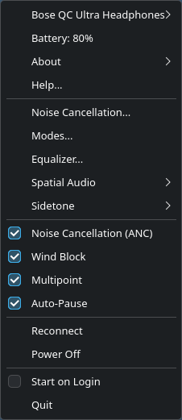
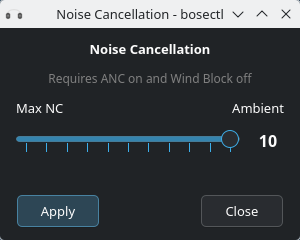
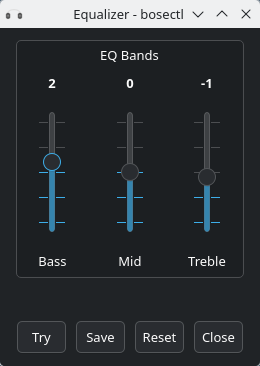
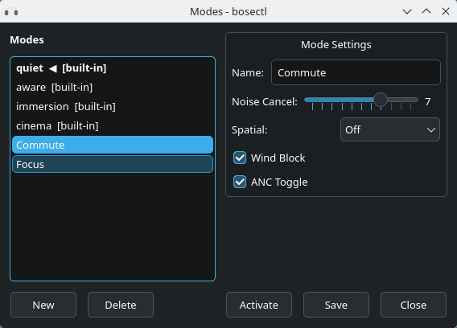
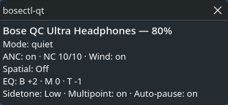
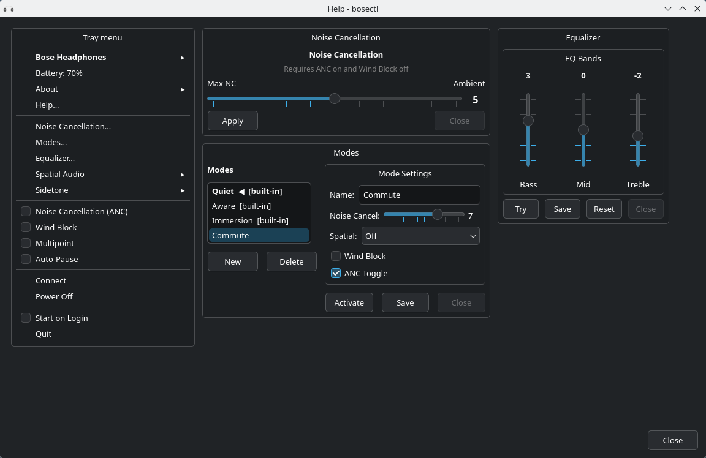
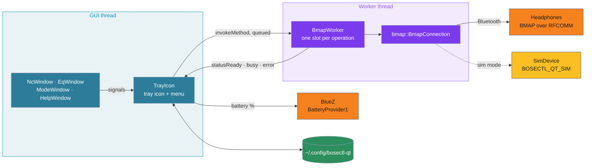

# bosectl-qt

A Qt6 system tray application for controlling Bose headphones over Bluetooth on Linux. Built on the reverse-engineered [bosectl](https://github.com/aaronsb/bosectl) BMAP library — no cloud, no accounts, no official app required.

To the best of my knowledge this is the first Qt/native tray app on Linux that supports the Bose QuietComfort Ultra Headphones.

## Screenshots

### Tray menu



### Noise cancellation



### Equalizer



### Mode manager



### Status notification

A left-click on the tray icon shows the headset's state.



### Help



## Features

- **Auto-discovery** of paired BMAP devices via `bluetoothctl`
- **Noise cancellation** slider (0–10) with a clear "Max NC → Ambient" labeling
- **ANC** and **Wind Block** toggles (both affect whether the NC slider is audible)
- **Mode manager** — view, activate, edit, create, and delete custom modes. Built-in presets (Quiet, Aware, Immersion, Cinema) are protected
- **Equalizer** — Bass / Mid / Treble sliders with Try / Save / Reset
- **Spatial audio** — Off, Room, Head Tracking
- **Sidetone** — Off, Low, Medium, High
- **Multipoint** and **Auto-Pause** toggles
- **Battery** in the menu, flagged at 15% and below, and published to BlueZ so desktop power indicators show it
- **Rename** the headphones; **firmware and MAC** under an *About* submenu
- **Status notification** on left-click: battery, mode, NC, spatial, EQ and toggles at a glance
- **Help window** mapping every menu entry and dialog, with the same text as the tooltips
- **Working indicator** across all windows for feedback during BT operations
- **Settings persistence** in `~/.config/bosectl-qt/` — remembers your last device
- **Start on Login** toggle in the menu, which writes `~/.config/autostart/bosectl-qt.desktop`
- **Cross-desktop** — uses plain `QSystemTrayIcon` so it works on KDE, GNOME, Xfce, Sway, and anything else with an SNI/XEmbed tray

## Supported devices

bosectl-qt talks to any headset the [bosectl](https://github.com/aaronsb/bosectl#supported-devices) library supports, but only the QC Ultra Headphones 2 has been tried end to end in this app.

| | Meaning |
|---|---|
| ✅ Yes | Verified in bosectl-qt on hardware |
| 🟡 Probably | Verified in the bosectl library; the app uses the same calls but nobody has reported on it yet |
| ⚪ Untested | The library recognises it with partial support, or the app lacks controls for what the device does |
| ❌ Not yet | In bosectl's device catalog without a tested configuration |

| Device | Codename | bosectl-qt | What to expect |
|---|---|---|---|
| QuietComfort Ultra Headphones (2nd Gen) | `wolverine` | ✅ Yes | Everything in the menu and windows |
| QuietComfort Ultra Earbuds (2nd Gen) | `edith` | 🟡 Probably | Same protocol as the headphones. One battery figure for the pair; the case is not shown |
| QuietComfort Headphones | `prince` | 🟡 Probably | EQ, modes and two custom profile slots. The NC slider, spatial audio and Wind Block change the active custom profile, so they report an error on Quiet or Aware. No ANC toggle |
| QuietComfort 45 | `duran` | 🟡 Probably | As the QuietComfort Headphones: EQ, modes, two custom slots, NC through the active custom profile |
| QuietComfort Earbuds | `lando` | ⚪ Untested | NC slider, EQ and four fixed modes. Profile editing reports "not supported" |
| QuietComfort 35 / 35 II | `baywolf` | ⚪ Untested | Battery, name and sidetone. Its ANR levels (off/low/high/wind) have no control in the app yet |
| Ultra Open Earbuds | `serena` | ⚪ Untested | Open-ear, so no NC. EQ, multipoint and mode switching |
| Noise Cancelling Headphones 700, QuietComfort Ultra Headphones (1st Gen), QuietComfort Earbuds II, QuietComfort Ultra Earbuds (1st Gen) | | ❌ Not yet | Recognised by product ID, but no configuration yet |

Have one of these? A report moves it up the table:

- **It works, or partly works, in bosectl-qt:** [open a device report](https://github.com/aaronsb/bosectl/issues/new?template=device-report.yml) with the firmware version and which menu entries and windows worked.
- **It is ⚪ or ❌:** the same report, with the output of `bosectl status` and `bosectl dump` attached. Those two commands capture what the library needs to write a configuration. [Adding a new device](https://github.com/aaronsb/bosectl/blob/main/docs/architecture.md#adding-a-new-device) describes the rest.
- **Something broke:** [open a bug here](https://github.com/aaronsb/bosectl-qt/issues/new), with the output of `bosectl-qt --verbose`.

## Installation

### Arch Linux (AUR)

```bash
# Stable release
yay -S bosectl-qt

# Git HEAD
yay -S bosectl-qt-git
```

(Replace `yay` with your preferred AUR helper, or use `makepkg` directly.)

### Other distros

Flatpak and AppImage builds are planned. For now, [build from source](#building).

## Building

### Dependencies

- CMake ≥ 3.16
- Qt6 (Widgets)
- libbluetooth (BlueZ)
- A C++17 compiler

On Arch:

```bash
sudo pacman -S qt6-base bluez-libs cmake
```

On Debian/Ubuntu:

```bash
sudo apt install qt6-base-dev libbluetooth-dev cmake build-essential
```

On Fedora:

```bash
sudo dnf install qt6-qtbase-devel bluez-libs-devel cmake gcc-c++
```

### Build

```bash
git clone --recursive https://github.com/aaronsb/bosectl-qt
cd bosectl-qt
cmake -B build
cmake --build build
./build/bosectl-qt
```

If you forgot `--recursive`, run:

```bash
git submodule update --init --recursive
```

### Test

```bash
make test            # or: ctest --test-dir build --output-on-failure
```

`bmap_tests` runs the vendored bosectl C++ suite at the pinned submodule
commit. The other suites cover the app: `BmapWorker` over a mock transport,
the start-on-login entry, the help content, and `tray_tests`, which drives
the tray menu and its windows offscreen against a simulated headset. Pass
`-DBOSECTL_QT_BUILD_TESTS=OFF` to CMake to skip them.

On a Plasma desktop, `make test-ui` runs the app in a nested KWin and Plasma
with real input and compares screenshots against goldens, and
`make screenshots` regenerates the images above. `make sim` runs the tray
against the simulated headset without Bluetooth. See
[docs/testing.md](docs/testing.md).

### Install

```bash
sudo cmake --install build
```

This installs the binary to `/usr/local/bin`, the desktop file to `/usr/local/share/applications`, the icon to the hicolor theme, and an autostart entry under `/usr/local/share/bosectl-qt/` (Arch: `/usr/share/bosectl-qt/`).

Autostart is opt-in per user. Check **Start on Login** in the tray menu, which writes `~/.config/autostart/bosectl-qt.desktop`; unchecking it removes the file. KDE Plasma lists the same entry under System Settings → Autostart, and the checkbox follows changes made there. To do it by hand instead:

```bash
mkdir -p ~/.config/autostart
cp /usr/share/bosectl-qt/bosectl-qt-autostart.desktop ~/.config/autostart/bosectl-qt.desktop
```

## Usage

1. Pair and connect your Bose headphones via `bluetoothctl` or your desktop's Bluetooth settings
2. Launch `bosectl-qt`
3. The tray icon auto-discovers the first connected BMAP device and shows its status in the tooltip
4. Left-click the tray icon for a status notification; right-click it for the full control menu
5. **Help...** in the menu explains every entry and window

The sliders and the Mode manager open separate windows instead of being embedded in the tray menu — this is a deliberate design choice because Qt's `QWidgetAction` doesn't render reliably inside menus on Wayland.

### Noise cancellation quirks

Bose firmware has a couple of interactions that aren't obvious from the UI alone:

- **ANC must be on** for the NC slider to have any audible effect — if you turn ANC off, the slider stops doing anything
- **Wind Block overrides the NC slider** — if Wind Block is on, the NC DSP is bypassed regardless of slider position

The NC window displays a reminder about these, and ANC / Wind Block are exposed as separate tray menu toggles so you can manage them independently.

## Architecture


```mermaid
flowchart LR
    subgraph gui["GUI thread"]
        tray["TrayIcon<br>tray icon + menu"]
        windows["NcWindow · EqWindow<br>ModeWindow · HelpWindow"]
    end
    subgraph worker["Worker thread"]
        bw["BmapWorker<br>one slot per operation"]
        conn["bmap::BmapConnection"]
    end
    headset["Headphones<br>BMAP over RFCOMM"]
    sim["SimDevice<br>BOSECTL_QT_SIM"]
    bluez["BlueZ<br>BatteryProvider1"]
    settings[("~/.config/bosectl-qt")]

    windows -- "signals" --> tray
    tray -- "invokeMethod, queued" --> bw
    bw -- "statusReady · busy · error" --> tray
    bw --> conn
    conn -- "Bluetooth" --> headset
    conn -. "sim mode" .-> sim
    tray -- "battery %" --> bluez
    tray <--> settings

    classDef ui fill:#2d7d9a,stroke:#94a3b8,color:#ffffff
    classDef core fill:#7c3aed,stroke:#94a3b8,color:#ffffff
    classDef external fill:#f6821f,stroke:#4a5568,color:#1a1a1a
    classDef test fill:#fbbf24,stroke:#4a5568,color:#1a1a1a
    classDef store fill:#2d8e5e,stroke:#94a3b8,color:#ffffff
    class tray,windows ui
    class bw,conn core
    class headset,bluez external
    class sim test
    class settings store
    style gui stroke:#0891b2,fill:#2d7d9a1a,color:#0891b2
    style worker stroke:#8b5cf6,fill:#7c3aed1a,color:#8b5cf6
```

All blocking Bluetooth I/O runs on a dedicated worker thread. The GUI queues operations via `QMetaObject::invokeMethod` and receives state updates via queued signals. A RAII `BusyGuard` around each worker slot emits `busy(true/false)` so every window can show a "Working…" indicator automatically.

The worker reaches the headset through a `Connector`, Bluetooth by default. `BOSECTL_QT_SIM=qc_ultra2` swaps in `SimDevice`, a simulated QC Ultra 2 the tests and screenshots run against ([docs/testing.md](docs/testing.md)). The tray publishes the battery level to BlueZ, so desktop power indicators show it; in sim mode it publishes nothing.

Settings are stored in `~/.config/bosectl-qt/bosectl-qt.conf` via `QSettings`.

## Roadmap

- [ ] Flatpak, AppImage and Debian packages (the AUR packages exist)
- [ ] ANR levels for the QuietComfort 35, which has no NC slider
- [ ] Per-bud and case battery for earbuds
- [ ] Button remapping (the library supports it)
- [ ] Voice prompt language
- [ ] Reports from the 🟡 and ⚪ devices in [Supported devices](#supported-devices)
- [ ] Translations

## Credits

- [bosectl](https://github.com/aaronsb/bosectl) — the reverse-engineered BMAP protocol library (C++, Rust, and Python implementations) that makes this possible
- [Bose](https://www.bose.com) — for making great headphones with a proprietary protocol that took a lot of patience to figure out

## License

MIT — see [LICENSE](LICENSE).

## Author

Aaron Bockelie
